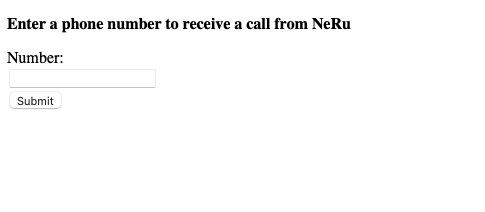

# Making an Outbound Call Using a Static Site, NeRu, Python and the Voice API

This project shows how to use NeRu and Python with a static HTML website to make an outbound call with the Voice API.



## Running the project

Create a Vonage Application if you do not have one already, and [link a phone number](https://dashboard.nexmo.com) to the application:

```sh
neru app create --name "neru application"
```

Then initialize NeRu, choosing the `python` for runtime and `skip` for the template:

```sh
neru init
```

This will create a `neru.yml` file for you, then add the entrypoints and the linked number under `configurations`:

```yml
project:
    name: $YOUR_PROJECT_NAME
instance:
    name: dev
    runtime: python3
    region: aws.euw1
    application-id: $YOUR_VONAGE_APPLICATION_ID
    entrypoint: [python3, main.py]
    capabilities:
        - voice
    configurations:
        contact:
            type: phone
            number: '$YOUR_VONAGE_NUMBER'
debug:
    name: debug
    entrypoint: [nodemon, --exec, python3, -m, debugpy, --listen, localhost:9229, main.py]
```

Create a Python virtual environment, Python 3.10 or higher is required:

```sh
python3 -m venv venv
```

Activate the Python virtual environment:

```sh
source venv/bin/activate
```

Install the dependencies:

```sh
pip install -r requirements.txt
```

Then start the project locally using:

```sh
neru debug
```

To deploy use the `Makefile`:

```sh
make deploy
```

Or run the following commands:

```sh
pip3 install -r requirements.txt --python-version 3.10 --platform manylinux2014_x86_64 --only-binary=:all: --target=./vendor

neru deploy
```
